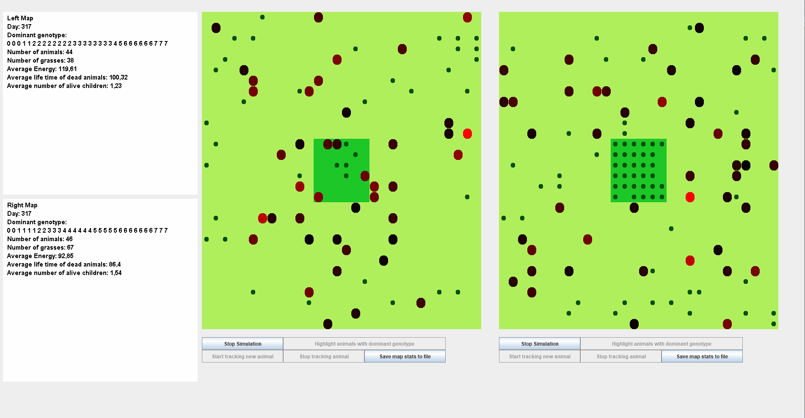

# Darwin World

This project has been made as project for Objective Programming conducted at AGH UST.  
Full project description in polish (taken from https://github.com/apohllo/obiektowe-lab) can be found in requirements.

# User manual

## This animal live simulator:
- draws map with animals and grasses. Each animal has individual color based on energy. 
The more red animal is the more energy it has. Black animals on the other hand are those who will most likely
end life soon.
- shows simulation statistics for each simulation in panels located on the left side of screen.
- Allows to track animal (showing its genotype, children and descendants bor during the time it was tracked) 
The tracked animal has purple color. To track animal:
1) Stop simulation
2) click on "track animal"
3) click on the animal you wish to track
In case you would like to track another animal repeat the above. 
- Allows to display any animal genotype - to do this simply click animal. (In case many animals are on the same position
animal with greatest energy will be chosen).
- Allows to show animals with dominant genotype upon stopping simulation.
- Allows to save average statistics to file.

### Coloring Order
It may happen that more than one animal will be on specific position.
Below is the coloring order in such case (starting from animals that have greatest priority while painting)
1. Tracked animal
2. Animal with highest energy
3. Animal with dominant genotype.

The reasoning behind that was to allow user to always see tracked animal as well as avoid situation when
user wants to track animal with dominant genotype and chooses top energy animal instead (such anomaly could occur
if positions 2 and 3 were swapped).

Therefore, if you highlited animals with dominant genotype, and nothing changed it is possible
that those sneaky creatures hide behind stronger friends ;) 

## Warning: parameters file should be located in the same directory as src.

The following libraries are being used:

junit:junit:4.13.1

org.apache.clerezza.ext:org.json.simple:0.4
